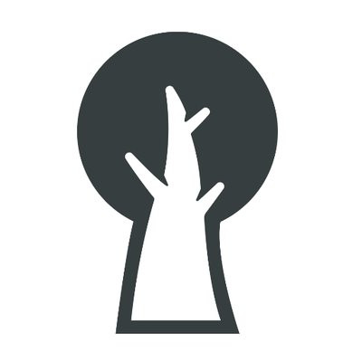
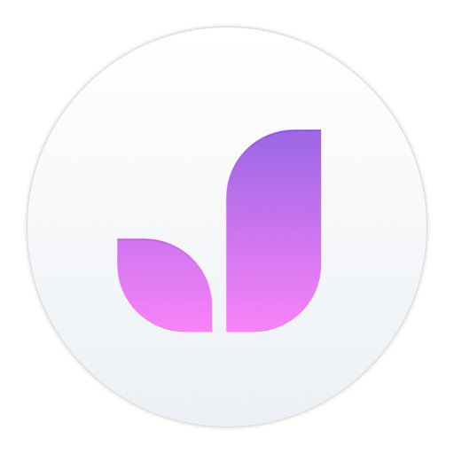

# Fildeling  

Tjenester som Dropbox eller Google Drive benyttes ofte til å enkelt sende filer til hverandre, og det er ikke tvil at slike tjenester har endret måten vi deler filer på. Men det finnes andre gode alternativer som tilbyr mer for å sikre din privatliv enten i form av kryptering eller hvor de er basert.  

Her er 3 forslag til tjenester og applikasjoner som tar din privatliv seriøst.

## [Firefox Send](https://send.firefox.com/)  
Mozilla nyeste tjeneste tillater at du sender filer opp til 1GB størrelse. Filene blir kryptert ved opplasting og et spesielt lenke blir laget. Denne deler du med mottaker som da har 24 timer for å laste ned filen.  
Minuset med tjenesten er at den sletter alle filene etter 24 timer og at den er såpass ny at den har ikke gått gjennom nøye uavhengige vurderinger.

<table>
 <tr>
   <td>
   
  </td>
   <td>
   OS: Web    
   </td>
 </tr>
</table>

## [Spideroak](https://spideroak.com/)  

Spideroak tilbyr fillagringstjeneste som er kryptert. Dette betyr at Spideroak ikke vet hvilken filer du har lagret hos dem. Den tilbyr klienter til alle store operativsystemer.

<table>
 <tr>
   <td>
   
  </td>
   <td>
   OS: Windows, macOS, Linux, iOS, Android      
   </td>
 </tr>
</table>

## [Jottacloud](https://www.jottacloud.com/nb/index.html)  
Norsk utviklet tjeneste som fungerer på samme måte som Dropbox, men den er underlagt norsk lovgiving da dataene er lagret i Norge (eller land med liknende lovgiving).  
Det negative med tjenesten så langt er setningen *"eller i et land med liknende eller enda strengere personvernlovgivning"* i personverngarantien da de ikke spesifiseres om dette er gjort og i hvilken land det gjelder. Og at data ikke er kryptert hos Jotta (det er det heller ikke f.eks. hos Dropbox).

<table>
 <tr>
   <td>
   
  </td>
   <td>
   OS: Windows, macOS, Android, iOS, Web      
   </td>
 </tr>
</table>
